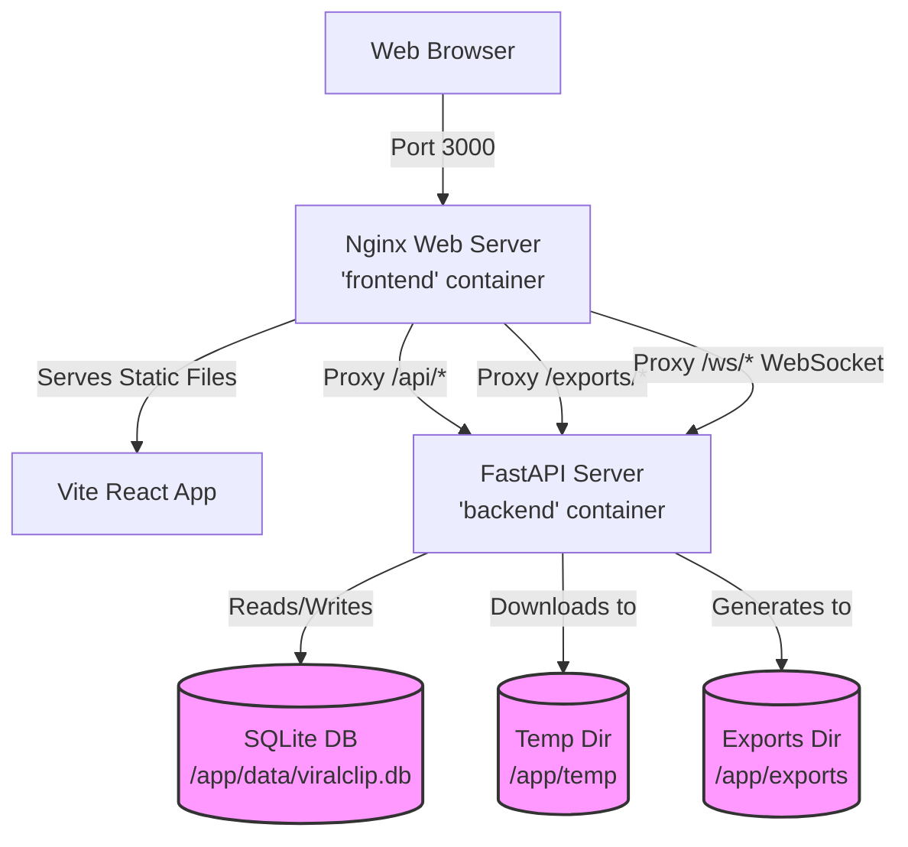

# ViralClip AI — Phase 5 Setup & Testing Guide

This guide details the Docker orchestration layer, Nginx routing configuration, automatic temp file cleanup scheduler, and how to verify and test the entire containerized architecture.

---

## 🏛️ What Phase 5 Added

| Feature | Detail |
|---------|--------|
| **Automatic Temp File Housekeeping** | A background scheduler runs every hour, purging all intermediate video and audio clips inside `temp/` older than 24 hours. |
| **Backend Dockerization** | A custom debian-slim Python image optimized with system dependencies like `ffmpeg`, OpenCV bindings, and build tools. |
| **Frontend Dockerization** | A production multi-stage image that installs packages via npm, builds static bundles with Vite, and serves them via Nginx. |
| **Nginx Reverse Proxy** | Static site host routing with seamless proxying for API requests (`/api`), static media assets (`/exports`), and live WebSocket telemetry streams (`/ws`). |
| **Multi-Container Orchestration** | Fully automated single-command boot with SQLite database persistence, file cache caching, and shared network. |

---

## 🛠️ Orchestration Architecture

Here is how the containers, volumes, and networks interact under Docker Compose:



---

## 🚀 How to Setup and Run

### 1. Prerequisite Environment Check
Ensure you have Docker and Docker Compose installed:
```bash
docker --version
docker-compose --version
```

Make sure your `backend/.env` file exists and has your Groq API key:
```env
GROQ_API_KEY=gsk_your_groq_api_key_here
```

### 2. Boot the Whole Stack
In the root directory where `docker-compose.yml` resides, run:
```bash
docker-compose up --build -d
```

This command will:
1. Build the backend image (installing system dependencies like `ffmpeg`).
2. Build the frontend image using a multi-stage approach, creating Nginx bundle.
3. Establish independent networks and persistent named volumes.
4. Launch both containers in detached background mode.

---

## 🔍 How to Verify and Test

Follow these steps to thoroughly verify the Phase 5 implementation:

### Step 1: Verify Containers are Active
Run `docker ps` to verify both containers are online:
```bash
docker ps
```
You should see:
- `viralclip-frontend` on port `0.0.0.0:3000->80/tcp`
- `viralclip-backend` on port `0.0.0.0:8000->8000/tcp`

### Step 2: Validate API and Health Endpoint
Make a quick request to the backend health endpoint:
```bash
curl http://localhost:8000/health
```
**Expected Response:**
```json
{
  "status": "ok",
  "app": "ViralClip AI",
  "version": "1.0.0",
  "groq_configured": true,
  "whisper_model": "large-v3-turbo"
}
```

Check the interactive OpenAPI Swagger docs at:
👉 **http://localhost:8000/docs**

### Step 3: Verify Nginx Routing & Proxying
Open **http://localhost:3000** in your browser. Nginx should serve the dashboard.

Inspect your browser's developer console network tab and verify:
- REST API requests are proxied via port `3000` (e.g. `http://localhost:3000/api/config` -> proxied to `http://viralclip-backend:8000/api/config`).
- WebSocket connections are proxied to `ws://localhost:3000/ws/job/{id}` -> proxied to backend WebSocket server.

### Step 4: Verify the Temp Cleanup Housekeeping Scheduler
Check the backend container logs to confirm both the persistent queue worker and the automatic temp files cleanup scheduler have launched successfully:
```bash
docker-compose logs backend
```
**Expected log patterns at boot:**
```text
viralclip-backend  | 2026-05-31 23:55:00,123 [INFO] main: Database initialized
viralclip-backend  | 2026-05-31 23:55:00,125 [INFO] main: Persistent queue worker loop started.
viralclip-backend  | 2026-05-31 23:55:00,126 [INFO] main: Automatic temp files cleanup scheduler started.
viralclip-backend  | 2026-05-31 23:55:00,127 [INFO] main: Running scheduled temp cleanup. Cutoff time: 2026-05-30 23:55:00.126000
```

### Step 5: Test a Batch Video Scraping Run
1. Go to the dashboard at **http://localhost:3000**.
2. Click **Create Short**.
3. Input one or more YouTube URLs (separated by newlines) into the batch input area.
4. Hit **Generate Clips**.
5. Observe the Dashboard:
   - Jobs are created in the `queued` state.
   - You should see the **Queue Position Badge** (e.g., `#1 in queue`, `#2 in queue`) dynamically updating.
   - The sequential queue worker will pull the oldest job, starting the pipeline (`downloading` -> `transcribing` -> `analyzing` -> `clipping` -> `done`).
   - WebSockets will push real-time progress percentages to the UI.
6. Verify the completed clips are downloadable and can be previewed!

---

## 🗑️ Tear Down
To stop and clean up containers (without losing database or models persistent data):
```bash
docker-compose down
```
To also delete the volumes (e.g., for a clean reset):
```bash
docker-compose down -v
```
